# 🎓 Proyecto: CRUD de Estudiantes y Carreras

Este proyecto consiste en el desarrollo de un **sistema CRUD (Create, Read, Update, Delete)** utilizando **Laravel** y **Tailwind CSS**.  
El objetivo es aplicar los conocimientos sobre **arquitectura MVC**, manejo de base de datos, validaciones y creación de interfaces funcionales para gestionar estudiantes y carreras en un sistema educativo.

---

## 📖 Descripción general

### 🧩 Vista previa del proyecto

Agrega aquí capturas de pantalla de tu sistema funcionando.

### Estudiantes
Lista de Estudiantes
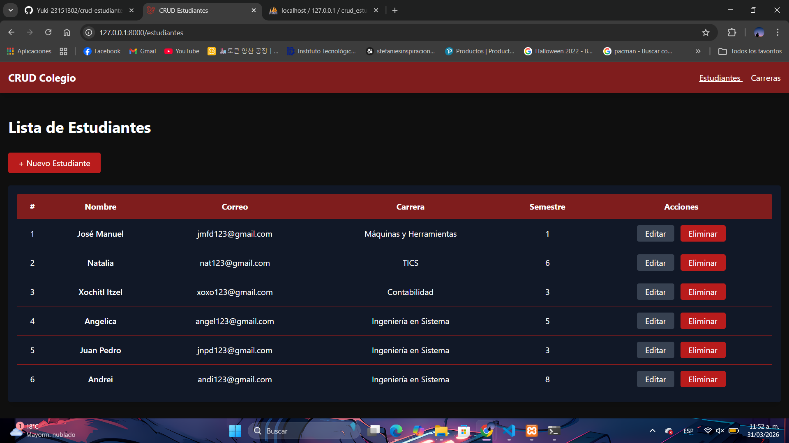!

Registrar Estudiante
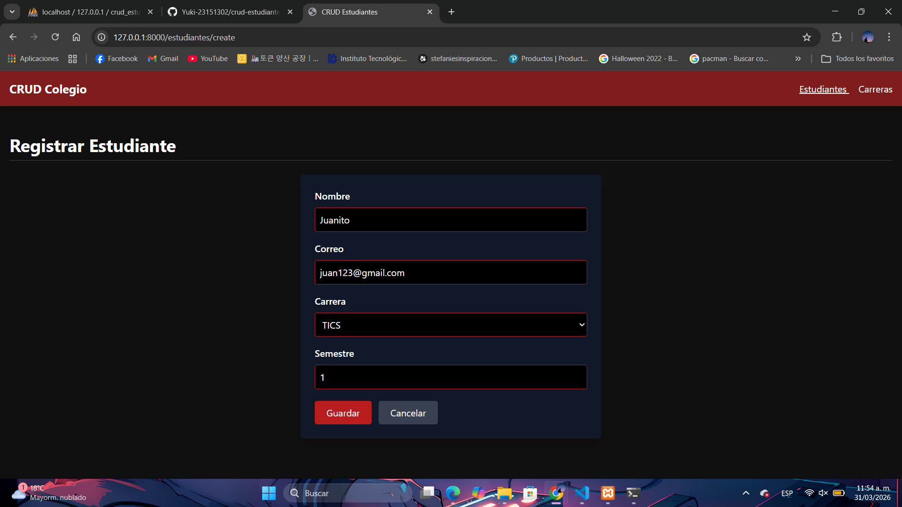 

Estudiante Registrado
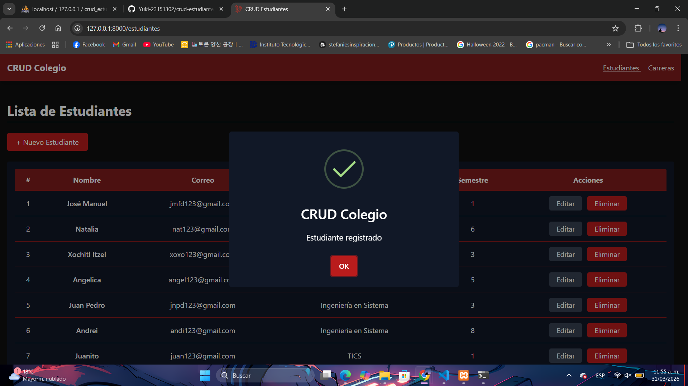  

Editar Estudiante
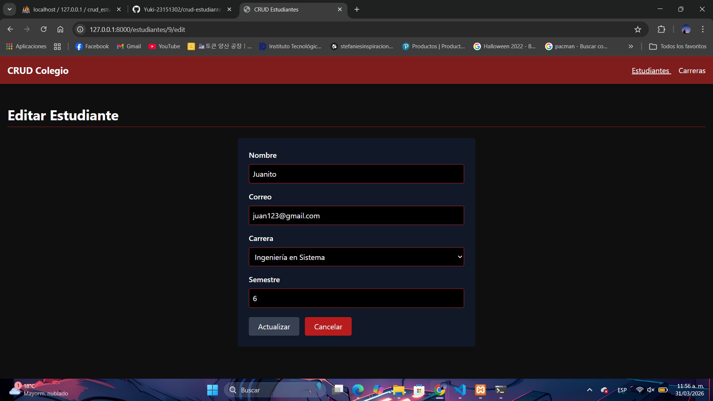  

Estudiante Actualizado


Confirmación de Eliminar Estudiante
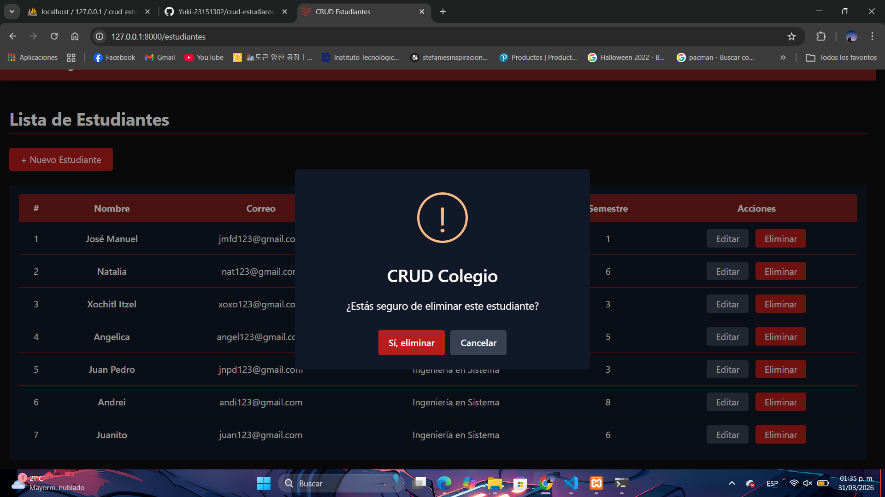

Estudiante Eliminado
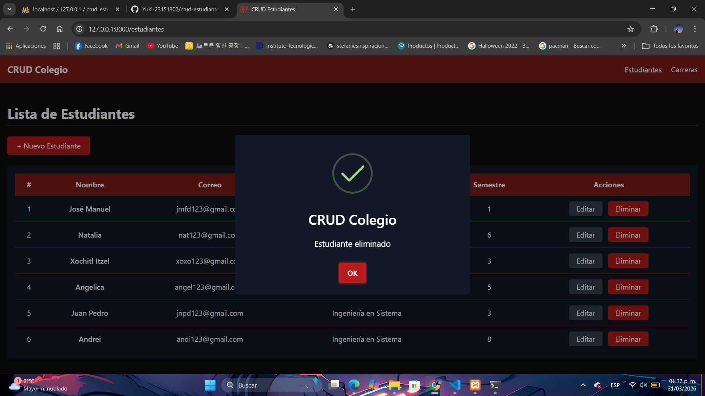 

### Carreras
Lista de Carreras
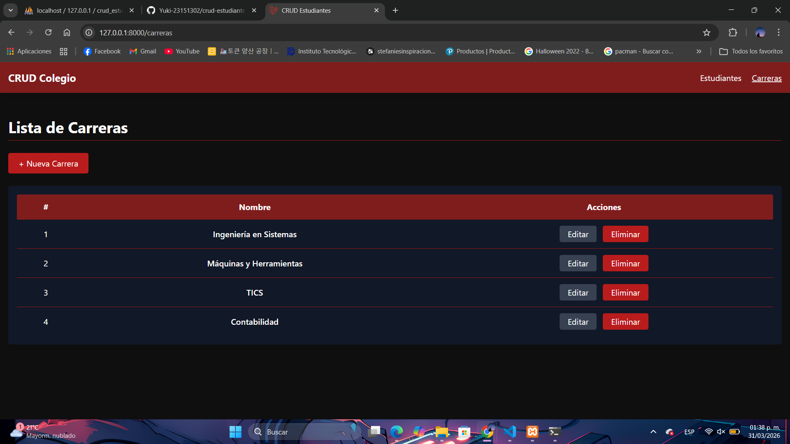

Registrar Carrera
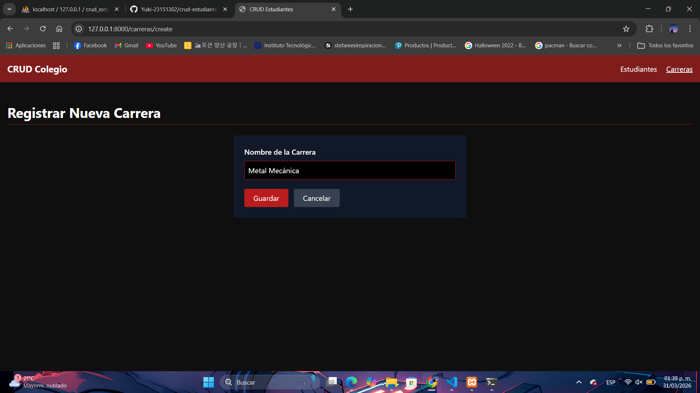 

Carrera Registrada
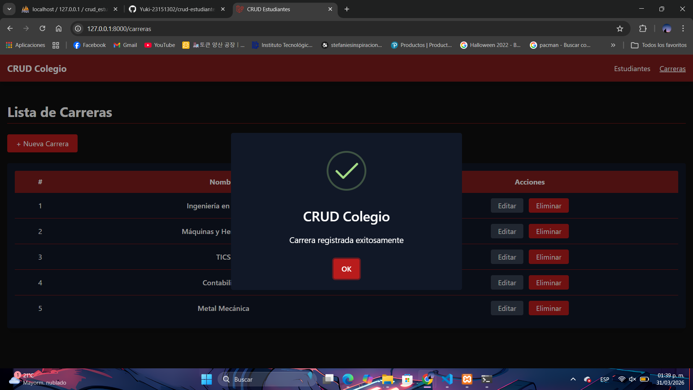 

Editar Carrera
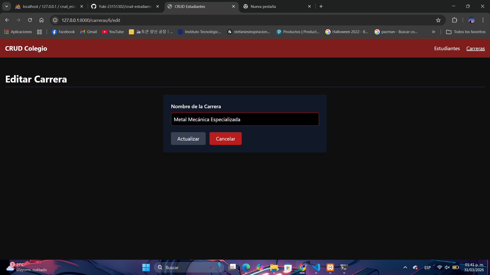  

Carrera Actualizada
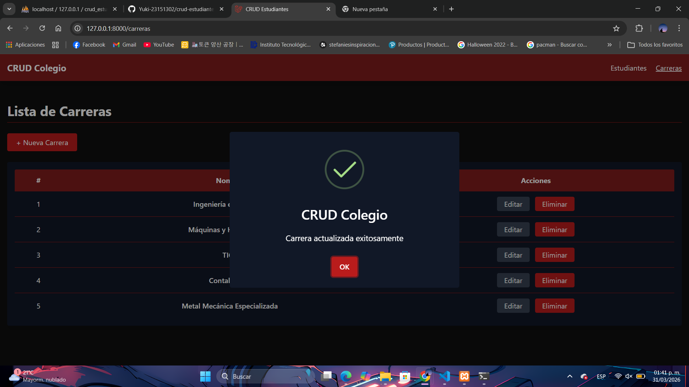 

Confirmación de Eliminar Carrera
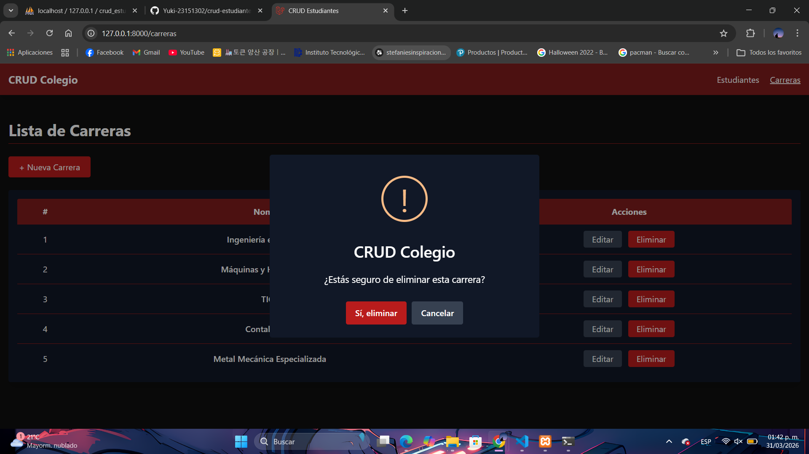

Carrera Eliminada
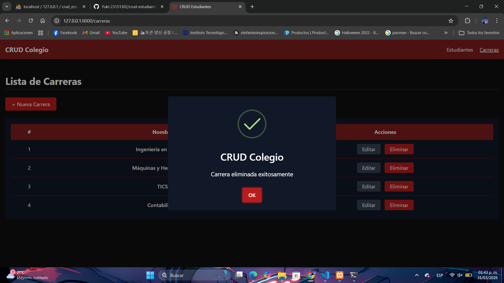 

---

### 🔗 Enlaces del proyecto

* **Repositorio en GitHub:** https://github.com/sweetiestrawberry/Unidad3pw

---

## 🧠 Proceso de desarrollo

### 🛠️ Tecnologías utilizadas
 *MySQL (XAMPP)  
* Tailwind CSS  
* Blade
* HTML5  
* Laravel 12  
* PHP 8.2  
* VIsual

---

## ⚙️ Funcionamiento del sistema

Ahora nos toco hacer esta página web funciona como una herramienta de administración académica que facilita el control, organización y actualización de datos de estudiantes y carreras de forma eficiente..incluye formularios para capturar datos, tablas para mostrar la información almacenada y botones para ejecutar cada una de las operaciones CRUD

### 🟢 Crear (Create)

 

**Carreras:**  
Formulario para registrar:  
* Nombre
* **Estudiantes:**  
Formulario para registrar:  
* Nombre  
* Correo electrónico  
* Carrera  
* Semestre 
  

"Ambas interfaces ejecutan una verificación de integridad de los datos previo a su almacenamiento. Una vez confirmada la operación en la base de datos, el sistema despliega notificaciones de confirmación: 'Registro de estudiante completado con éxito' o 'Alta de carrera procesada correctamente'."

---

### Leer

**Estudiantes:**  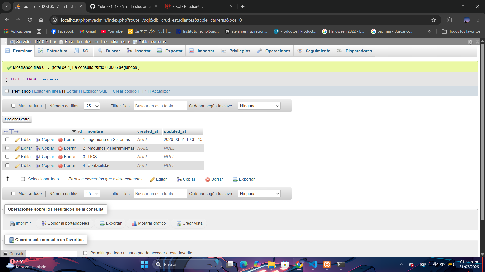
 Tabla con todos los estudiantes registrados:  
* Número (numeración visual)  
* Nombre  
* Correo  
* Carrera  
* Semestre  

Carreras 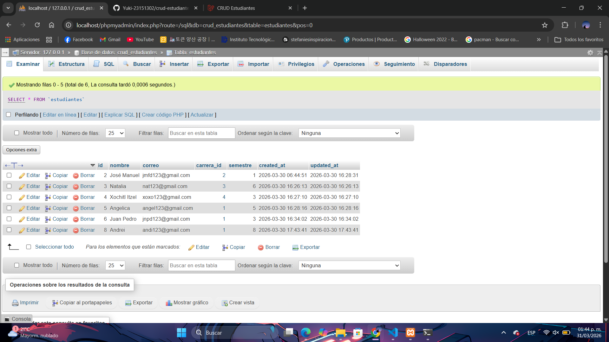

 tabla con todas las carreras registradas:  
* Número  
* Nombre  

---

 (Update)


🗑️ Eliminación de registros

El sistema permite borrar información directamente desde la tabla de datos:

Se puede seleccionar el elemento que se desea eliminar
Al realizar la acción, el registro desaparece del sistema
Se muestran notificaciones para confirmar la operación, por ejemplo:
“Registro de estudiante eliminado correctamente”
“Registro de carrera eliminado correctamente”
🔢 Consideración sobre la numeración en pantalla

La numeración que aparece en las tablas cumple únicamente una función visual:

Se presenta de forma ordenada y continua (1, 2, 3, …)
Se ajusta automáticamente cuando se elimina algún registro
No representa el identificador real almacenado en la base de datos

El identificador original permanece intacto, ya que corresponde a la clave primaria, lo cual garantiza la correcta gestión y consistencia de la información dentro del sistema.
---


---

  Estructura del proyecto

```bash
crud-estudiantes/
│
├── app/
│   ├── Models/
│   │   ├── Estudiante.php
│   │   └── Carrera.php
│   │
│   └── Http/
│       └── Controllers/
│           ├── EstudianteController.php
│           └── CarreraController.php
│
├── database/
│   └── migrations/
│       ├── create_carreras_table.php
│       └── create_estudiantes_table.php
│
├── resources/
│   └── views/
│       ├── layouts/
│       │   └── app.blade.php
│       │
│       ├── estudiantes/
│       │   ├── index.blade.php
│       │   ├── create.blade.php
│       │   └── edit.blade.php
│       │
│       └── carreras/
│           ├── index.blade.php
│           ├── create.blade.php
│           └── edit.blade.php
│
├── routes/
│   └── web.php
│
└── .env
```

---

## Conocimientos adquiridos

A lo largo del desarrollo de este proyecto fortalecí mis habilidades en el uso del framework Laravel, especialmente entendiendo mejor su estructura basada en el modelo MVC. Pude trabajar con modelos para interactuar con la base de datos, controladores para gestionar la lógica de la aplicación y vistas dinámicas utilizando Blade.Aun que como formatee la compu tuve que volver a instalar todo , casi lloro la vrdd , desde instalar visual hasta lo recien visto 
También puse en práctica la creación de relaciones entre tablas, específicamente entre estudiantes y carreras, lo que me ayudó a comprender de manera más clara el uso de llaves foráneas y la organización de la información en una base de datos relacional.


🔧 Oportunidades de mejora

Para mejorar este proyecto en el futuro, se podrían considerar los siguientes aspectos:

Integrar paginación en las tablas para manejar grandes volúmenes de datos
Añadir funcionalidades de búsqueda y filtrado de información
Optimizar las validaciones mostrando mensajes más claros al usuario
Incorporar un sistema de autenticación para mayor seguridad
Mejorar la interfaz con animaciones que hagan la experiencia más interactiva
---

## 📚 Recursos útiles

Durante el desarrollo del proyecto se consultaron diversas documentaciones y recursos:

* [Documentación oficial de Laravel](https://laravel.com/docs)
* [Tailwind CSS](https://tailwindcss.com/docs)
* [MDN Web Docs](https://developer.mozilla.org/es/)
* Instrucciones Mra : https://cloud.aguascalientes.tecnm.mx/moodle/mod/assign/view.php?id=847345
* Tutorial Youtube  https://www.google.com/url?sa=i&source=web&rct=j&url=https://www.youtube.com/watch?v%3D29mihvA_zEA%26t%3D137&ved=2ahUKEwj59d2fseyTAxWT78kDHY6RHMQQqYcPegYIAQgAEDc&opi=89978449&cd&psig=AOvVaw1LfhWcWJf8IjeuU0zf-nSv&ust=1776223215760000

---

## 👩‍💻 Autor

* Nombre completo: Paulette Montserrat Hernandez Chairez 
* Carrera: TICS
* Grupo: --
* Correo institucional: 23151207@aguascalientes.tecnm.mx

---

## Relfexion  :  El desarrollo de este proyecto me permitió comprender de manera más clara cómo funciona un sistema web completo utilizando Laravel. A lo largo de la implementación del CRUD, pude identificar la importancia de cada uno de los componentes del patrón MVC y cómo trabajan en conjunto para lograr una aplicación funcional y organizada.

Uno de los aspectos más relevantes fue darme cuenta de que no solo se trata de que el sistema funcione, sino de mantener una buena estructura en el código, ya que esto facilita su mantenimiento y escalabilidad. Además, trabajar con validaciones y formularios me ayudó a entender la importancia de controlar los datos que ingresan los usuarios.
